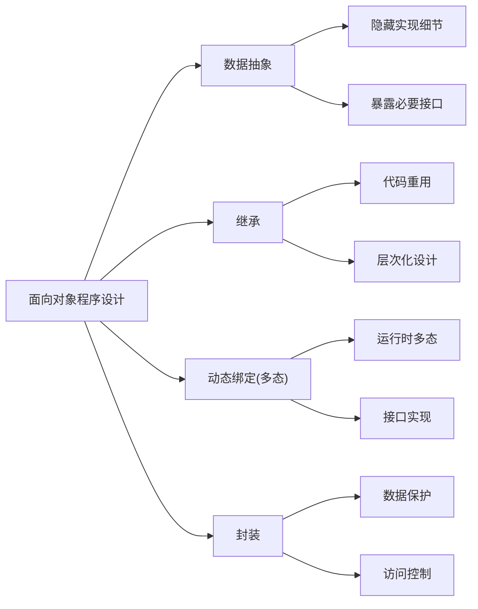
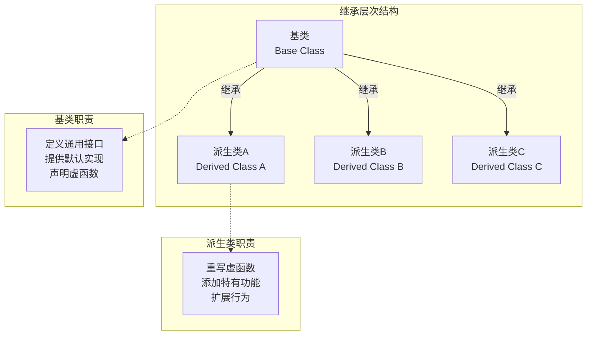
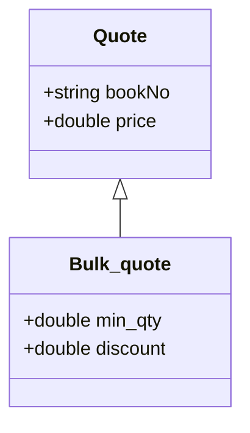
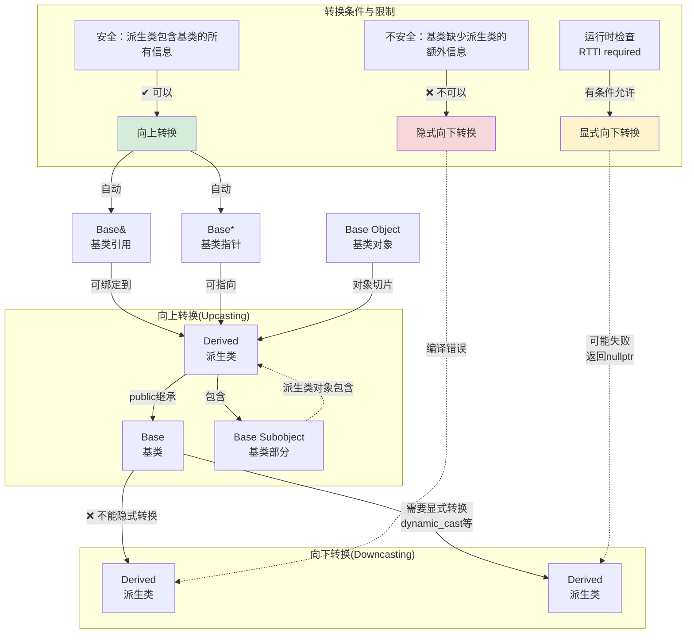
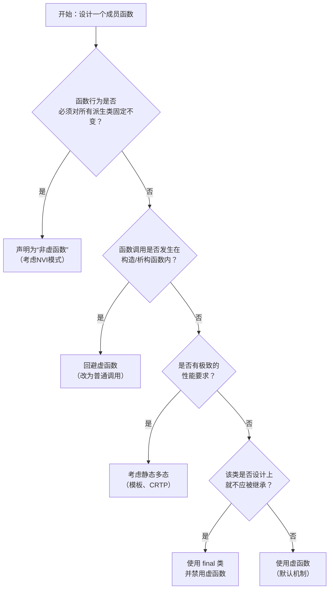
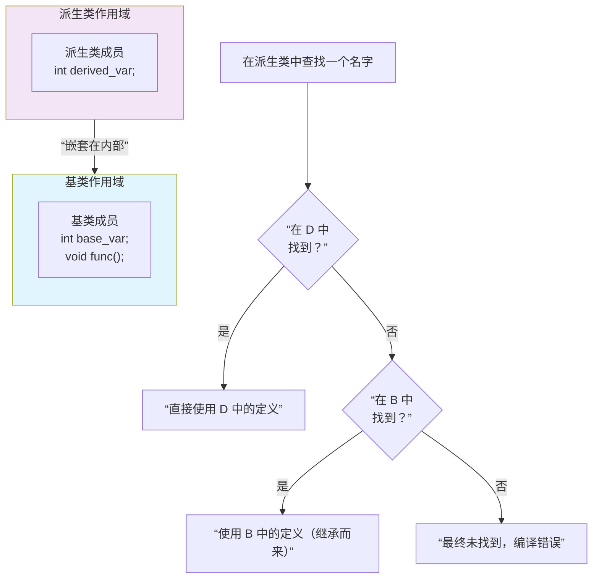

# 第十五章 面向对象程序设计



继承和动态绑定对程序的编写有两方面的影响：

1. 我们可以更容易地定义与其他类相似但不完全相同的新类。
2. 使用这些彼此相似的类编写程序时，我们可以在一定程度上忽略掉它们的区别。

## 15.1 OOP:概述

__面向对象程序设计(object-oriented programming)核心思想:__

1. 数据抽象： 将类的接口与实现分离。
2. 继承： 可以定义相似的类型并对其相似关系建模。
3. 动态绑定：可以在一定程度上忽略相似类型的区别，以统一的方式使用它们的对象。

### 继承

通过`继承(inheritance)`联系在一起的类构成一种层次关系。



```cpp
//Quote.hpp
//基类(Base class)
class Quote{
    public:
        std::string isbn() const;
        virtual double net_price(std::size_t n) const;
};

```

```cpp
//Bulk_quote.hpp
//派生类(Derived): 继承自Quote类 
class Quote : public Quote{
    public:
    double net_price(std::size_t n) const override;
};

```

___虚函数(virtual function)： 在C++语言中，基类希望它的派生类各自定义适合自身的版本，就要将函数声明为虚函数___
__派生类必须通过类派生列表(class derivation list)来明确指出它是从那些基类继承而来的。__

```cpp
//格式
class Base{
    public:
        virtual type method_name(parameter list...); 
};

class Derivated : public Base{
    public:
        type method_name(parameter list...) override;
};
```

因为Bulk_quote在它的派生列表中使用了`pulic`关键字，所以我们可以把Bulk_quote的对象当作是Quote的对象来使用。

1. 派生类必须在其内部对所有重新定义过的虚函数进行声明。
2. 派生类也可以在需要定义的虚函数前面加上`virtual`关键字。
3. C++11新标准允许派生类显式注明它将使用哪个成员函数改写基类的虚函数，在函数的形参列表之后加上`override`关键字。

### 动态绑定

通过使用`动态绑定(dynamic binding)`，我们可以用同一段代码分别处理Quote和Bulk_quote的对象。

```cpp
    double print_total(ostream& os, const Quote& item, size_t n)
    {
        double ret = item.net_print(n);
        os << "ISBN: " << item.isbn() 
           << " # sold: " << n << " total due: " << ret << endl;
        return ret;
    }


    Quote base;
    Bulk_quote bulk;
    print_total(cout,base,20);
    print_total(cout,bulk,20);
```

上述过程中，函数的运行版本由实参决定，所以动态绑定也被称为`运行时绑定(run-time binding)`。
<p style ="color:yellow">在C++语言中，当我们使用基类的引用(指针)调用一个虚函数时将发生动态绑定。</p>

## 15.2 定义基类和派生类

### 15.2.1 定义基类

```cpp
//Quote.hpp
//完整定义 基类 Quote
#ifndef QUOTE_HPP
#define QUOTE_HPP

#include <string>
class Quote {
public:
  Quote() = default;
  Quote(const std::string &book, double sales_price)
      : bookNo(book), price(sales_price) {}
  std::string isbn() const { return bookNo; };
  virtual double net_price(std::size_t n) const { return n * price; };
  virtual ~Quote() = default;
  
private:
  std::string bookNo = "";

protected:
  double price = 0.0;
};

#endif // QUOTE_HPP
```

<p style = "color:gold">基类通常都应该定义一个虚析构函数，即使该函数不执行任何实际操作也是如此。</p>

### 成员函数与继承

<p style = "color:red">派生类可以继承基类的成员，但是必须对 virtual 的成员提供自己新的定义以覆盖(override)基类继承而来的旧定义。</p>

在C++中，基类必须将它的两种成员函数区分开来：

1. 希望其派生类进行覆盖(override)的函数。—— 虚函数 virtual type method_name(parameter list ...);
2. 希望派生类直接继承而不改变的函数。

3. 任何构造函数以外的非静态函数都可以是虚函数。
4. `virtual`关键字智能出现在类内部的声明语句之前而不能用于类外部的函数定义。
5. 如果基类把一个函数声明为`虚函数`，则派生类中也是隐性的虚函数。
6. 成员函数如果没有声明为`虚函数`，则其解析过程发生在编译时，而不是运行时(动态绑定)。

### 访问控制与继承

派生类可以继承定义在基类中的成员，但是派生类的成员函数不一定有权访问从基类继承而来的成员。

派生类可以访问基类的`public`公有成员，而不能访问`private`私有成员。但是还有一种`protected`受保护的成员，派生类可以访问，

### 15.2.1节练习

#### 练习15.1

虚成员是`基类`希望`派生类`为自己提供新的操作以`override(覆盖)`基类本身操作的成员。

#### 练习15.2

特性|`public`|`private`|`protected`
:--:|:--:|:--:|:--:
类内部访问|✔️|✔️|✔️
类外部访问|✔️|❌|❌
派生类访问|✔️|❌|✔️
封装级别|low|mid|top
设计意图|公有接口|实现细节|扩展接口
修改影响|影响所有用户|不影响派生类|可能影响派生类

`public`:

1. 最小暴露：只暴露必要的，隐藏一切可能隐藏的
2. 稳定契约：公共接口一旦发布，尽量保持稳定
3. 直观易用：API应该自解释，减少文档依赖
4. 一致性：统一的命名、参数顺序、错误处理
5. 防御性：验证输入，保护不变量，安全失败
6. 正交性：每个方法做一件事，避免功能重叠
7. 向后兼容：通过扩展而非修改来演进API
8. 充分文档：每个公共成员都应有清晰文档
9. 不易误用：设计上防止常见错误
10. 遵循标准：遵循语言习惯和领域惯例

`private`:

1. 实现细节：不需要被派生类知道或使用的内部实现
2. 数据隐藏：需要严格控制的内部状态
3. 不变式维护：只对该类有影响
4. 辅助方法：仅提供内部函数实现

`protected`:

1. 模板方法模式： 提供可以覆盖的方案
2. 框架设计： 允许派生类自己独有的操作
3. 抽象基类： 定义派生类必须实现的接口
4. 派生类需要但隐藏外部： 共享属性(OpenGL的状态机)

#### 练习15.3

```cpp
//Quote.hpp
#ifndef QUOTE_HPP
#define QUOTE_HPP

#include <string>
class Quote {
public:
  Quote() = default;
  Quote(const std::string &book, double sales_price)
      : bookNo(book), price(sales_price) {}
  std::string isbn() const { return bookNo; };
  virtual double net_price(std::size_t n) const { return n * price; };
  virtual ~Quote() = default;
  
private:
  std::string bookNo = "";

protected:
  double price = 0.0;
};

#endif // QUOTE_HPP
```

```cpp
double print_total(const Quote& item, std::size_t n)
{
    double ret = item.net_price(n);
    cout << "ISBN: " << item.isbn() 
         << " # sold: " << n << " total due: " << ret << endl; 
    return ret;
}
```

### 15.2.2 定义派生类

派生类必须通过类派生代表(class derivation list)明确指出它是从哪个基类继承来的。

格式:`class son : public base{};`

每个基类前面可以有以下三种说明符中的一个:`public`、`private`、`protected`

派生类必须将其继承而来的成员函数中需要覆盖的(`virtual`)进行重新声明。

```cpp
class Bulk_quote: public Quote{
    public:
        Bulk_quote() = default;
        Bulk_quote(const string&, double,size_t, double);
        double net_price(std::size_t n) const override;
    private:
        std::size_t min_qty = 0;
        double discount = 0.0;
};
```

Bulk_quote从Quote中继承了isbn()和bookNo、price等数据成员,因为`net_price`是`virtual`的所以我们必须为它重新声明`override`。

如果一个派生是公有的，则基类的公有成员也是派生类接口的组成部分。

因为我们的访问说明符是`public`，所以Quote的isbn()函数被我们的`Bulk_quote`隐性包含了。

单继承: 大多数类都只继承自一个类。

### 派生类中的虚函数

如果派生类没有覆盖基类的某个虚函数，则该虚函数的类型类似于其他的普通成员，派生类会直接继承其在基类的版本。

### 派生类对象及派生类向基类的类型转换

派生类对象的组成部分

1. 派生类自定义的(非静态)成员的子对象
2. 派生类继承的基类对应的子对象

<p style = "color:pink">如果有多个基类，那么这样的子对象也会有多个。</p>



因为派生类对象中含有与其基类对应的组成部分，所以我们能把派生类对象当作基类对象来使用，也能将基类的指针或引用绑定到派生类中的基类部分上。

```cpp
Quote item;
Bulk_quote bulk;
Quote *p = &item;
p = &bulk;
Quote& r = bulk;
```

这种转换称为`派生类到基类的(derived-to-base)`类型转换。

### 派生类构造函数

派生类对象中含有从基类继承的成员，但是不能直接初始化，必须通过基类的构造函数来初始化基类部分的成员。

<p style = "color:red">每个类控制它自己的成员初始化。</p>

```cpp
#pragma once

#include "Quote.hpp"
#include <string>
class Bulk_quote : public Quote{
    public:
    Bulk_quote(const std::string& book,double price,std::size_t n,double dis):Quote(book,price),min_qty(n),discount(dis){}
    double net_price(std::size_t n) const override;

    private:
    std::size_t min_qty = 0;
    double discount = 0.0;
};
```

___首先初始化基类的部分，然后按照声明顺序依次初始化派生系成员___

### 派生类使用基类的成员

派生类可以访问基类的`public`和`protected`成员。

```cpp
  //price 是 基类的 protected 成员 可以直接访问
    double net_price(std::size_t n) const override{
        if (n > min_qty) {
            return  n * (1 - discount) * price;
        } else {
            return price * n;
        }
    }

```

<p style = "color:red">关键概念：每个类负责定义各自的接口。要想与类的对象交互必须通过使用该类的接口。</p>

### 继承与静态成员
如果基类定义了一个静态成员，则在整个继承体系中只存在该成员的唯一定义——只存在唯一的实例。
```cpp
class Base{
    public:
        static void statmem();
};

class Derived : public Base{
    void f(const Derived&);
};

```

静态成员遵循通用的访问控制规则，如果`Base`类中的成员是private的，则`Derived`类无权访问它。

```cpp

void Derived::f(const Derived& dervived_obj){
    Base::statmem();        //通过Base类的statmem
    Derived::statmem();     //Derived类继承了Base
    dervived_obj.statmem(); //对象访问
    statmem();              //this对象访问
}
```

### 派生类声明
格式| class Name;
:--:|:--:
例子| class Bulk_quote;

派生列表及定义有关的其他细节必须与类的主体一起出现。

### 被用作基类的类
如果我们想将某个类用作基类，则该类必须已经定义而非仅仅声明：
```cpp
// class Base;
// class Dervived:public Base{};
//错误 Base必须被定义
```
原因：
1. 派生类中包含并且可以使用它从基类继承而来的成员。
2. 类不能派生它本身。

```cpp
class Base{/******/};
class D1 : public Base{/******/};   //Base是D1的 直接基类(direct base)
class D2 : public D1{/******/};     //Base是D2的 间接基类(indirect base)
```
一个类可以是基类，同时也是派生类。
<p style="color:gold">每个类都会继承直接基类的所有成员。所以，最终派生类将包含它的直接基类的子对象以及每个间接基类的子对象。</p>

### 防止继承的发生
当我们不希望某个类不被继承、不考虑是否可以作为基类。C++11提供了`final`关键字。
```cpp
class NoDerived final{/**/};
```

### 15.2.2节练习
#### 练习15.4
<table>
    <tr>
        <th>  </th>
        <th>语句</tg>
        <th>是否正确</th>
        <th>原因</th>
    </tr>
    <tr>
        <td>(a)</td>
        <td>class Derived: public Derived{/**/};</td>
        <td>❌</td>
        <td>类不能派生它自身</td>
    </tr>
    <tr>
        <td>(b)</td>
        <td>class Derived: private Base{/**/};</td>
        <td>✅</td>
        <td>基类的public和protected变成private</td>
    </tr>
    <tr>
        <td>(c)</td>
        <td>class Derived: public Base;</td>
        <td>❌</td>
        <td>派生列表以及与定义有关的细节必须与类的主体一起出现</td>
    </tr>
</table>

#### 练习15.5
```cpp
#pragma once

#include "Quote.hpp"
#include <string>
class Bulk_quote : public Quote{
    public:
    Bulk_quote(const std::string& book,double price,std::size_t n,double dis):Quote(book,price),min_qty(n),discount(dis){}
    //price 是 基类的 protected 成员 可以直接访问
    double net_price(std::size_t n) const override{
        if (n > min_qty) {
            return  n * (1 - discount) * price;
        } else {
            return price * n;
        }
    }

    private:
    std::size_t min_qty = 0;
    double discount = 0.0;
};
```


#### 练习15.6
```cpp
#include "Quote.hpp"
#include "Bulk_quote.hpp"
#include <cstddef>
#include <iostream>

double print_total(const Quote& item, std::size_t n){
    double ret = item.net_price(n);
    std::cout << "ISBN: " << item.isbn() << " # sold: " << n << " total due: " << ret << std::endl;
    return ret;
}

int main(){
    Quote q ("abcd", 4.99);
    print_total(q, 50);

    Bulk_quote bq("efgh", 9.99, 10, 0.15);
    print_total(bq, 30);

    std::cin.get();
    return 0;
}
```


#### 练习15.7
```cpp
#ifndef LIMITED_QUOTE_HPP
#define LIMITED_QUOTE_HPP

#include "Quote.hpp"
#include <cstddef>
#include <string>
class Limited_quote : public Quote{
    public:
        Limited_quote(const std::string& book, double price, std::size_t n, double dis):Quote(book, price),max_qty(n),discount(dis){}

        double net_price(std::size_t n) const override{
            if (n > max_qty) {
                return max_qty * (1 - discount) * price + (n - max_qty) * price;;
            }else {
                return n * (1 - discount) * price;
            }
        }
    private:
    std::size_t max_qty = 0;
    double discount = 0.0;
};

#endif// LIMITED_QUOTE_HPP
```

### 15.2.3 类型转换与继承
<p style="color:red">理解基类和派生类之间的类型转换是理解C++语言面向对象编程的关键所在。</p>

通常情况下，我们把引用或指针绑定到一个对象上，则引用或者真的类型应与对象的类型一致。
```cpp
//声明函数
void fun(int ,int ){}
//函数指针别名 ptr_fun 指向返回void的函数
typedef void (*ptr_fun)(int,int);
//C++11的等价语法 创建一个fun_ref的类型 等价于typedef void func(int,int)
using fun_ref = void(int,int);
int main(){
    //将 函数指针指向fun
    ptr_fun p1= fun;
    //函数引用
    fun_ref& ref= fun;
    //函数指针指向fun
    fun_ref* p2= fun;
}
```

或者对象类型含有一个可接受的const类型转换规则。

但是继承关系的类是一个例外： 我们可以将基类的指针或引用绑定到派生类对象上。
1. 使用`Base`类的引用或指针，我们不清楚该引用的真实类型是基类还是派生类。
2. 智能指针也支持派生类向基类的转换。

### 静态类型与动态类型
当我们使用继承关系的类型时，必须将一个变量或表达式的`静态类型(static type)`与该表达式表示对象的`动态类型(dynamic type)`区分开。

静态类型：在编译时总是已知的，它是在变量声明时的类型或表达式生成的类型。

动态类型：变量或表达式表示的内存中的对象的类型。直到运行时才可知。

如果表达式既不是引用也不是指针，那么它的动态类型和静态类型永远一致。

### 不存在从基类向派生类的隐式类型转换



派生类能转换到基类是因为包含一个基类部分。而基类的对象可能是派生类的一部分，也可能不是，所以不存在从基类向派生类的自动类型转换。

### ...在对象之间不存在类型转换
派生类向基类的自动类型转换只对指针或引用类型有效，在派生类类型和基类类型之间不存在这样的转换。

```cpp
Bulk_quote bulk;//派生类对象
Quote item(bulk);//调用Quote::Quote(const Quote&)
item = bulk;//调用Quote::operator=(const Quote&)
```
上述代码中，会忽略Bulk_quote的部分，将Bulk_quote部分切掉。(切片)

### 15.2.3节练习
#### 练习15.8
静态类型：编译时确定，不可变，编译时检查
动态类型：运行时确定，可变，运行时多态


#### 练习15.8
1. 基类指针指向派生类
2. 基类引用绑定到派生类对象
3. 基类的虚函数
4. 容器
5. 智能指针

```cpp
#include <iostream>
#include <string>
#include <vector>
#include <memory>

using namespace std;

class Super {
public:
    Super(int i) : age(i) {}
    virtual ~Super() = default;
    virtual ostream& printInfo(ostream& os = cout) {
        os << "Super:" << age;
        return os;
    }
protected:
    int age;
};

class Derived : public Super {
public:
    Derived(int i, string name) : Super(i), _name(name) {}
    ostream& printInfo(ostream& os = cout) override {
        os << "Derived: " << _name << " " << age;
        return os;
    }
private:
    string _name;
};

// 1. 基类指针指向派生类
void firstDemo() {
    cout << "1. 基类指针指向派生类:" << endl;
    Super* sp = new Derived(2, "Alice");
    sp->printInfo() << endl;
    delete sp;
    cout << endl;
}

// 2. 基类引用绑定到派生类对象
void secondDemo() {
    cout << "2. 基类引用绑定到派生类对象:" << endl;
    Derived d(32, "C");
    Super& s = d;
    s.printInfo() << endl;
    cout << endl;
}

// 3. 虚函数调用
void thirdDemo() {
    cout << "3. 虚函数调用（多态）:" << endl;
    Super* sp = new Derived(25, "Bob");
    
    // 通过指针调用
    sp->printInfo() << endl;
    
    // 通过引用调用
    Super& sr = *sp;
    sr.printInfo() << endl;
    
    delete sp;
    cout << endl;
}

// 4. 容器中的多态
void fourthDemo() {
    cout << "4. 容器中的多态:" << endl;
    
    // 4.1 值语义 - 对象切片
    cout << "4.1 值语义（对象切片）:" << endl;
    std::vector<Super> vs;
    vs.push_back(Derived(12, "Alice"));
    for (const auto& s : vs) {
        s.printInfo() << endl;
    }
    
    // 4.2 指针语义 - 保持多态
    cout << "\n4.2 指针语义:" << endl;
    std::vector<Super*> vsp;
    vsp.push_back(new Derived(13, "Bob"));
    vsp.push_back(new Super(14));
    for (auto ptr : vsp) {
        ptr->printInfo() << endl;
        delete ptr; // 清理
    }
    
    // 4.3 智能指针 - 现代C++推荐
    cout << "\n4.3 智能指针:" << endl;
    std::vector<std::unique_ptr<Super>> smartVec;
    smartVec.push_back(std::make_unique<Derived>(15, "Charlie"));
    smartVec.push_back(std::make_unique<Super>(16));
    for (const auto& ptr : smartVec) {
        ptr->printInfo() << endl;
    }
    cout << endl;
}

// 5. 智能指针的多态
void fifthDemo() {
    cout << "5. 智能指针的多态:" << endl;
    
    // unique_ptr
    std::unique_ptr<Super> uptr = std::make_unique<Derived>(23, "Lisa");
    cout << "unique_ptr: ";
    uptr->printInfo() << endl;
    
    // shared_ptr
    std::shared_ptr<Super> sptr1 = std::make_shared<Derived>(24, "David");
    std::shared_ptr<Super> sptr2 = sptr1; // 共享所有权
    cout << "shared_ptr: ";
    sptr1->printInfo() << endl;
    
    cout << endl;
}

int main() {
    firstDemo();
    secondDemo();
    thirdDemo();
    fourthDemo();
    fifthDemo();
    
    return 0;
}
```


#### 练习15.10
用派生类代替基类，也是多态的一种使用。iostream是基类，我们可以用它们的派生类fstream、ifstream这些来代替。

<p style = "color:gold">关键概念：存在继承关系的类型之间的转换规则</p>

__要想理解具有继承关系的类之间发生的类型转换，有三点非常重要__

1. 从派生类向基类的类型转换只对指针或引用有效。
2. 基类像派生类不存在隐式转换。
3. 派生类向基类的类型转换也可能由于访问受限而变得不可行。

## 15.3 虚函数
在C++语言中，当我们使用基类的引用或指针调用一个虚成员函数时会执行动态绑定(运行时确定)。
<p style = "color:red">因为直到运行时才会确定调用的是哪个版本的虚函数，所以所有虚函数都必须有定义。</p> 

__必须为每一个虚函数提供定义！不管是否被用到，因为编译器无法确定使用哪个虚函数。__

### 对虚函数的调用可能在运行时才被解析
当某个虚函数通过指针或引用调用时，编译器产生的代码直到运行时才能确定调用哪个版本的函数。被调用的函数是绑定到指针或者引用上的对象的动态类型相匹配的版本。

```cpp
Quote base("0-201-82470-1",50);
print_total(cout,base,10); //调用 Quote::net_price
Bulk_quote derived("0-201-82470-1",50,5,.19);
print_total(cout,derived,10); //调用 Bulk_quote::net_price
```
___动态绑定:必须通过指针或引用调用虚函数才会发生。___

如果通过普通类型的表示调用虚函数，编译时就会将调用版本确定下来。
```cpp
double print_total_use_parm(const Quote item, std::size_t n){
    double ret = item.net_price(n);
    std::cout << "ISBN: " << item.isbn() << " # sold: " << n << " total due: " << ret << std::endl;
    return ret;
}
```

<p style="color:lightgreen"><br>关键概念:C++的多态性</br>
<br>OOP的核心思想是多态性(polymorphism):具有继承关系的多个类型,无需在意它们的差异。</br></p>
<p style="color:lightblue">C++支持多态性的根本:通过引用或指针的静态类型与动态类型不同。</p>

 ### 派生类中的虚函数
 当我们在派生类中`override`了某个虚函数，可以再一次使用`virtual`关键字指出性质。(一旦某个函数被指名了是虚函数，所有派生类中都是虚函数，所以没必要。)

 一个派生类的函数如果覆盖了某个继承而来的虚函数，则它的形参类型必须与覆盖的基类函数一致。返回类型如果是类本身的`&`或者`*`的话，可以返回可以类型转换的`&`或者`*`。

 ```cpp
// 基类
class Base {
public:
    virtual Base* clone() const {
        std::cout << "Base::clone()" << std::endl;
        return new Base(*this);
    }

    virtual void print() const {
        std::cout << "Base" << std::endl;
    }

    virtual ~Base() {}
};

// 派生类
class Derived : public Base {
public:
    // 覆盖基类的clone函数，返回类型为Derived*，这是Base*的派生类指针，因此是协变返回类型。
    virtual Derived* clone() const override {
        std::cout << "Derived::clone()" << std::endl;
        return new Derived(*this);
    }

    virtual void print() const override {
        std::cout << "Derived" << std::endl;
    }
};
 ```

 ### final和override说明符(关键字)
 派生类如果定义了一个函数与基类中虚函数的名字相同但是形参列表不同，这仍然是合法的行为。编译器将认为新定义的这个函数与基类中原有的函数是互相独立的。——这不是一个好习惯，只是规则允许。

 ```cpp
struct B{
    virtual void f1(int) const;
    virtual void f2();
    void f3();
};

struct D1:B{
    void f1(int) const override; //正确，与基类的f1匹配
    void f2(int) override; //错误，基类的f2()没有形参
    void f3() override; //错误，基类的f3不是virtual函数
    void f4() override; //错误，基类没有f4()
};
 ```

 我们还能将某个函数指定为`final`，如果我们指定为`final`了，则任何尝试覆盖该函数的操作都将引发错误。
 ```cpp
struct D2: B{
    void f1(int) const final; //不允许后续的派生类覆盖f1(int)
};

struct D3:D2{
    void f2(); //正确，从间接基类B继承而来的f2()
    void f1(int) const;//错误，直接基类将该函数声明为final
};
 ```
<p style="color:red">final 和 override 说明符出现在形参列表(包括任何const或引用修饰符) 以及尾置返回类型之后。</p>

```cpp
// 基本形式
void func() const override;

// 带引用限定符
void func() & final;

// 带尾置返回类型
auto func() -> int override;

// 组合形式
auto func() const && -> Type override final;
```

### 虚函数与默认实参
虚函数也可以拥有默认实参，如果某次函数调用使用了默认实参，则该实参值由本次调用的静态类型决定。
```cpp
//Demo
struct Super{
    //默认实参10
    virtual void fun(int i = 10) const{
        std::cout << i << std::endl;
    } 
};

struct Dervied : Super{
    //默认实参20
    void fun(int i = 20) const override {
        std::cout << i << std::endl;
    }
};

void printInfo(const Super& item){
    item.fun();
}

void test(){
    Super s1;
    Dervied d1;

    printInfo(s1); //打印10
    printInfo(d1); //打印10
}
```
<p style="color:gold">如果虚函数使用默认实参，则基类和派生类中定义的默认实参最好一致。</p>


### 回避虚函数的机制
某些情况下，我们希望对虚函数的调用不要进行动态绑定，而是强迫其执行某个特定版本。使用作用域可以实现这一目的。
```cpp
//强行调用基类中定义的函数版本而不管baseP的动态类型到底是什么？
double undiscounted = baseP->Quote::net_price(42);
```
<p style="color:red">通常情况下，只有成员函数(或者友元)中的代码才需要使用作用域运算来回避虚函数的机制。</p>

什么时候需要回避虚函数的默认机制：
1. 当函数行为必须“固定不变”时
2. 在构造函数和析构函数内部
3. 对性能有极端要求的场景
4. 当需要编译期确定性和类型安全时
5. 当类设计意图就是“非多态”时
6. 需要明确控制派生类扩展点时
7. 在多重继承或复杂继承层次中


### 15.3节练习
#### 练习15.11
```cpp
//Quote.hpp
class Quote{
    public:
    //new method
      virtual void debug() const {
        std::cout << "bookNo: " << bookNo 
                  << " price: " << price 
                  << std::endl;
                  }
};

//Bulk_quote.hpp
class Bulk_quote:public Quote{
    public:
    void debug() const override {
        std::cout << "min_qty: " << min_qty 
        << " discount: " << discount
        << std::endl;
    }
};
```

#### 练习15.12
有必要。
`override`修饰符：
1. 表示是派生类继承的虚函数。
2. 明确告诉编译器是想要覆盖已存在的函数。
3. 帮助我们识别形参列表是否与基类相同。

`final`修饰符: 明确表示不允许后续派生类覆盖该函数。

同时使用`override`和`final`修饰符表示：
1. 覆盖基类的函数。
2. 派生类不可以覆盖我的虚函数。
3. 意图清楚明确。

#### 练习15.13
```cpp
//base.hpp
#ifndef BASE_HPP
#define  BASE_HPP
#include <ostream>
#include <string>
class base{
    std::string basename;
    public:
    base(std::string s = ""):basename(s){}
    std::string name() const {return basename;}
    virtual void print(std::ostream& os) const {
        os << this->name();
    }
    virtual ~base() = default;
};
#endif // BASE_HPP

//derived.hpp
#ifndef DERIVED_HPP
#define DERIVED_HPP

#include "base.hpp"
#include <ostream>
#include <string>

class derived : public base {  
public:
    derived(std::string s, int n) : base(s), mem(n) {}
    
    int getMem() const { return mem; }
    
    void print(std::ostream& os) const override {
        // 正确调用基类的print函数
        base::print(os);  // 修正：去掉多余的参数声明
        os << " " << mem; // 可以添加分隔符
    }
    
    ~derived() override = default;
    
private:
    int mem;
};

#endif // DERIVED_HPP
```

#### 练习15.14
```cpp
//test()
    bobj.print(); //调用base::print base的对象
    dobj.print(); //调用derived::print derived的对象
    bp1->name();  //调用base::name() base指针指向base对象
    bp2->name();  //调用base::name() 继承基类，触发切片，所以调用基类。base指针指向derived对象 
    br1.print();  //调用base::print  base引用捆绑base对象
    br2.print();  //调用derived::print base引用捆绑derived对象
    //指针或者引用可以动态绑定 所以base的指针指向派生类 和 base的引用捆绑派生类 会触发动态绑定
```

## 15.4 抽象基类
### 纯虚函数
纯虚函数：告诉用户该函数无意义，和普通的虚函数不一样。
```cpp
virtual type method_name() const = 0;
```
我们也可以为纯虚函数提供定义，不过函数体必须定义在类的外部——我们不能在类的内部为一个`=0`的虚函数提供函数体。
```cpp
#pragma once

#include "Quote.hpp"
#include <iostream>
#include <string>
class Disc_quote:public Quote{
    public:
        Disc_quote() = default;
        Disc_quote(const std::string& book,double price,std::size_t qty, double disc)
                    :Quote(book, price),quantity(qty),discount(disc){}

        double net_price(std::size_t) const = 0;
    protected:
        std::size_t quantity = 0;
        double discount = 0.0;
};

double Disc_quote::net_price(std::size_t n) const {
    std::cout << "Disc_quote::net_price()" << std::endl;
    return 0.0;
}
```

### 含有纯虚函数的类是抽象基类
抽象基类(abstract base class):含有(或者未经覆盖直接继承)纯虚函数的类是抽象基类。
1. 抽象基类负责定义接口，派生类负责实现接口。
2. 不能创建一个抽象基类的对象。

### 派生类构造函数只初始化它的直接基类
每个类各自控制其对象的初始化过程。
```cpp
#pragma once

#include "Disc_quote.hpp"
#include "Quote.hpp"
#include <iostream>
#include <string>
class Bulk_quote : public Disc_quote{
    public:
    Bulk_quote() = default;
    Bulk_quote(const std::string& book,double price,std::size_t qty,double disc):Disc_quote(book, price, qty, disc){}
    //price 是 基类的 protected 成员 可以直接访问
    double net_price(std::size_t n) const override{
        if (n > quantity) {
            return  n * (1 - discount) * price;
        } else {
            return price * n;
        }
    }
    void debug() const override {
        std::cout << "min_qty: " << quantity 
                  << " discount: " << discount
                  << std::endl;
    }
};
```
<p style = "color:gold">
<br>关键概念：重构(refactoring) </br>
负责重新设计类的体系以便将操作或数据从一个类移动到另一个类。(对于面向对象的应用程序来说，这是一种很普遍的现象。)
</p>

### 练习15.4节练习
#### 练习15.15
```cpp
//基类 Quote.hpp
#ifndef QUOTE_HPP
#define QUOTE_HPP

#include <iostream>
#include <string>
class Quote {
public:
  Quote() = default;
  Quote(const std::string &book, double sales_price):bookNo(book), price(sales_price){}

  std::string isbn() const { return bookNo;}
  virtual double net_price(std::size_t n) const { return n * price; };
  virtual ~Quote() = default;

  virtual void debug() const {std::cout << "bookNo: " << bookNo 
                                        << " price: " << price 
                                        << std::endl;}
private:
    std::string bookNo;
protected:
  double price = 0.0;
};

#endif // QUOTE_HPP

//抽象基类 Disc_quote.hpp
#pragma once

#include "Quote.hpp"
#include <iostream>
#include <string>
class Disc_quote:public Quote{
    public:
        Disc_quote() = default;
        Disc_quote(const std::string& book,double price,std::size_t qty, double disc)
                    :Quote(book, price),quantity(qty),discount(disc){}

        double net_price(std::size_t) const = 0;
    protected:
        std::size_t quantity = 0;
        double discount = 0.0;
};

double Disc_quote::net_price(std::size_t n) const {
    std::cout << "Disc_quote::net_price()" << std::endl;
    return 0.0;
}

//派生类 Bulk_quote.hpp
#pragma once

#include "Disc_quote.hpp"
#include "Quote.hpp"
#include <iostream>
#include <string>
class Bulk_quote : public Disc_quote{
    public:
    Bulk_quote() = default;
    Bulk_quote(const std::string& book,double price,std::size_t qty,double disc):Disc_quote(book, price, qty, disc){}
    //price 是 基类的 protected 成员 可以直接访问
    double net_price(std::size_t n) const override{
        if (n > quantity) {
            return  n * (1 - discount) * price;
        } else {
            return price * n;
        }
    }
    void debug() const override {
        std::cout << "min_qty: " << quantity 
                  << " discount: " << discount
                  << std::endl;
    }
};
```


#### 练习15.16
```cpp
#ifndef LIMITED_QUOTE_HPP
#define LIMITED_QUOTE_HPP

#include "Disc_quote.hpp"
#include "Quote.hpp"
#include <cstddef>
#include <string>
class Limited_quote : public Disc_quote{
    public:
        Limited_quote(const std::string& book, double price, std::size_t n, double dis):Disc_quote(book, price,n,dis){}

        double net_price(std::size_t n) const override{
            if (n > quantity) {
                return quantity * (1 - discount) * price + (n - quantity) * price;;
            }else {
                return n * (1 - discount) * price;
            }
        }

};

#endif// LIMITED_QUOTE_HPP
```

#### 练习15.17
```cpp
int main(){
    // Quote q ("abcd", 4.99);
    // print_total(q, 50);
    // print_total_use_parm(q, 50);
    // Bulk_quote bq("efgh", 9.99, 10, 0.15);
    // print_total(bq, 30);
    // print_total_use_parm(bq, 30);

    Disc_quote disc;

    std::cin.get();
    return 0;
}

//以下信息为windows 下 使用ninja + cl-clang + GNU CLI 输出的信息

//打印信息： error: variable type 'Disc_quote' is an abstract class 表示该类是一个抽象基类

// note: unimplemented pure virtual method 'net_price' in 'Disc_quote' 表示表达无法实现纯虚函数在该类
```

## 15.5 访问控制与继承
每个类分别控制各自的成员初始化过程，还分别控制着其成员是否可以被派生类访问。
### 受保护的成员
`protected`关键字来声明它希望与派生类分享但是不想被其他公开访问使用的成员。
1. 和私有成员类似，受保护的成员对于类的用户来说是不可访问的。
2. 和公有成员类似，受保护的成员对于派生类的成员和友元来说是可访问的
3. 派生类的成员或友元只能通过派生类对象来访问基类的受保护对象。
4. 派生类对于一个基类对象中的受保护成员没有任何访问特权。
```cpp
class Base{
    protected:
        int prot_mem;
};
class Sneak : public Base{
    friend void clobber(Sneaky&);
    friend void clobber(Base&);
    int j;
};

void clobber(Sneaky& s){s.j = s.prot_mem = 0;}//正确。通过Sneaky对象访问private和protected成员
void clobber(Base& b){b.prot_mem = 0;} //错误 clobber不能访问Base的protected成员
```

派生类的成员和友元智能访问派生类对象中的基类部分的受保护成员，对于普通基类对象中的成员不具有特殊的访问权限。

### 公有、私有和受保护继承
访问权限的因素影响：
1. 基类中该成员的访问说明符： 对基类成员的访问权限只与基类中的访问说明符有关。
2. 派生类的派生列表中的访问说明符： 派生访问说明符对于派生类的成员(友元)能否访问其直接基类的成员没任何影响。
```cpp
class Base{
    public:
        void pub_mem();
    protected:
        int prot_mem;
    private:
        char priv_mem;
};

struct Pub_Derv : public Base{
    int f(){return prot_mem;}//正确 访问protected成员
    char g(){return priv_mem;}//错误 无法访问private成员
};

struct Priv_Derv: private Base{
    int f1() const { return prot_mem;}//正确，private不影响派生类访问权限
};
```

派生访问说明符： 控制派生类用户对于基类成员的访问权限
1. public: 派生类遵循基类原有的说明符
2. private: 派生类继承基类的所有成员都变私有
3. protected: 派生类继承基类的所有成员都变受保护的
```cpp
Pub_Derv d1;
Priv_Derv d2;
d1.pub_mem(); //正确 pub_mem在Pub_Derv中是public
d2.pub_mem();//错误 pub_mem在Priv_Derv中是private

struct Derived_from_Public: public Pub_Derv{
    int use_base(){return prot_mem;}//正确，在Pub_Derv仍然是protected
};

struct Derived_from_Private: public Priv_Derv{
    int use_base(){return prot_mem;}//错误，在Priv_Derv中已经隐性转换为private私有成员了
};
```

<table>
    <tr>
        <th> </th>
        <th>基类访问说明符</th>
        <th>public</th>
        <th>private</th>
        <th>protected</th>
    </tr>
    <tr>
        <th>派生访问说明符</th>
        <td></td>
        <td>基类成员在派生类中的访问权限</td>
        <td>基类成员在派生类中的访问权限</td>
        <td>基类成员在派生类中的访问权限</td>
    </tr>
    <tr>
        <th>public</th>
        <td></td>
        <td>public</td>
        <td>不可访问</td>
        <td>protected</td>
    </tr>
    <tr>
        <th>private</th>
        <td></td>
        <td>private</td>
        <td>不可访问</td>
        <td>private</td>
    </tr>
    <tr>
        <th>protected</th>
        <td></td>
        <td>protected</td>
        <td>不可访问</td>
        <td>protected</td>
    </tr>
</table>


### 派生类向基类转换的可访问性
继承方式 | 指针/引用转换 | 对象转换
:--:|:--:|:--:
public|总是允许|总是允许
private|仅在派生类中允许|不允许
protected|仅在派生类及其子类中允许|不允许

```cpp
class B{};
//派生类对直接基类的类型转换对于成员函数和友元函数都是可访问的 与派生访问权限无关

class D : public B{
    
    friend void D_use_B(Base& item);
    void transToB(Base& item){ item = *this; }
}; //可以直接转换成基类
D d1;
B *b = &d1;

class D2 : protected B{
    friend void D2_use_B(B& item);
    void transToB(B& item){ item = *this; }
};
D2 d2;
// b = &d2; 不能完成该转换

class D3 : private B{
    friend void D3_use_B(B& item);
    void transToB(Base& item){ item = *this; }
};
D3 d3;
// b = &d3; 不能使用该转换

class D_Pub_D : public D {
    friend void D_Pub_D_Use_B(B&);//可行
    void transToB(B& b){ b = *this;} //可行
};

class D_Prot_D : protected D2{
    friend void D_Pro_D_Use_B(B&);//可行
    void transToB(B&b){ b = *this;}//可行
};

class D_Priv_D: private D3{
    // firend void D_Priv_D_Use_B(B&); 被直接基类隐藏了，无法完成类型转换
    // void transToB(B&b){ b = *this}; 同上
};
```

关键概念：类的设计与被保护的成员
1. 类的实现者: 负责编写类的成员和友元的代码——既能访问公有部分(接口)也能访问私有部分
2. 普通用户：只能访问公有部分(接口)
3. 派生类的用户：能访问公有部分(接口)和受保护部分。

### 友元与继承
友元不能传递也不能继承。—— 每个类负责各自成员的访问权限。

### 改变个别成员的可访问性
有时候需要改变派生类继承的权限，可以通过`using`声明。
```cpp
class Base{
    public: 
    std::size_t size() const {return n;}
    protected:
    std::size_t n;
};
class Derived: private Base{
    public:
        using Base::size;
    protected:
        using Base::n;
};
```

在类的内部使用`using`声明语句，将类的直接和间接基类中的任何可访问成员(除了`private`成员)标记出来。

using声明|public|private|protected
:--:|:--:|:--:|:--:
访问权限|类的所有用户都可以访问|只有类内部和友元可以访问|派生类、友元、成员都可以访问

### 默认的继承保护级别
默认情况下：
`struct`:public
`class`:private

```cpp
class Base{};
struct D1 : Base{};//public
class D2 : base{}; //private
```
`struct`和`class`唯一的差别：
1. 默认访问说明符
2. 默认派生访问说明符
私有派生类最好显式`private`声明出来，令私有继承关系清晰明了。

### 15.5节练习

#### 练习15.18
```cpp
    Base::Pub_Derv d1;
    Base::Priv_Derv d2;
    Base::Prot_Derv d3;
    Base::Dervied_from_Public dd1;
    Base::Dervied_from_Private dd2;
    Base::Dervied_from_Protected dd3;
    Base::Base *p = &d1; //合法，public继承
    // p = &d2;
    // p = &d3;
    p = &dd1;//合法，public继承
    // p = &dd2;
    // p = &dd3;
    // 只有派生类是完全使用Public继承基类才能使用派生类往基类转换。
```


#### 练习15.19
```cpp
struct Dervied_from_Private: private Priv_Derv{
    int use_base(){return prot_mem;}
    // void memfcn(Base& b) {b = *this;}
    //派生类对直接基类的类型访问都是允许的
    //如果派生类对于间接基类的访问说明符是public和protected，也是允许的
    //但是派生类的直接基类对于间接基类是private，那么完成类型转换(直接基类修饰成private了)
};

```

#### 练习15.20
上述。

#### 练习15.21
```cpp
//基类几何图形
class Geometric{};

class Geometrice2D: GeoMetrice{};
class Geometrice3D: GeoMetrice{};
//派生类 矩形
class Rectangle : public Geometric2D{};
//派生类 圆形
class Circle : public Geometric2D{};
//派生类 球形
class Sphere : public Geometric3D{};
//派生类 锥形
class Cone : public Geometric3D{};
```


#### 练习15.22
```cpp
#ifndef GEOMETRIC_HPP
#define GEOMETRIC_HPP
    class Geometric{
        public:
            Geometric(double w, double h):_w(w),_h(h){}
        protected:
            double _w;
            double _h;
    };

    class Geometric2D:public Geometric{
        public:
            Geometric2D(double w, double h):Geometric(w, h){};
            virtual double aera() = 0;
    };

    class Geometric3D:public Geometric{
        public:
            Geometric3D(double w, double h, double l):Geometric(w, h),_length(l){}
            virtual double volume() = 0;
        protected:
            double _length;
    };

    class Rectangle :public Geometric2D{
        public:
            Rectangle(double w, double h):Geometric2D(w, h){}
            double aera() override{
                return _w * _h;
            }
    };

    class Circle : public Geometric2D{
        public:
            Circle(double w,double h):Geometric2D(w,h){}
            double aera() override{
                return _h*PI;
            }
        private:
            inline static double PI = 3.14; 
    };

    class Sphere : public Geometric3D{
        public:
            Sphere(double w, double h,double l):Geometric3D(w, h, l){}
            double volume() override{
                return (4/3)*PI * _w * _h*_length;
            }
        private:
        inline static double PI = 3.14;
    };

    class Cone: public Geometric3D{
        public:
            Cone(double w, double h, double l):Geometric3D(w, h, l){}
            double volume() override{
                return (1/3)*PI*_h*_w*_length;
            }
        private:
            inline static double PI = 3.14;
    };
#endif
```


## 15.6 继承中的类作用域
派生类的作用域嵌套在基类的作用域之内



```cpp
//代码中
class B{};
class D : public B{};

//二进制中
class B{
    class D : public B{

    };
};
```

### 在编译时进行名字查找
对象、指针、引用的静态类型决定了那些成员可见。
<br><p style= "color:gold">基类的静态类型无法访问到派生类的模型，(哪怕动态编译)。</p></br>

关键点与设计哲学
1. 安全第一：这条规则保证了类型安全。如果编译器允许bp->derived_only()通过，而bp实际指向的可能只是一个纯Base对象（那里根本没有derived_only函数），程序就会在运行时崩溃。C++通过在编译期禁止这种操作来避免这类错误。
2. 接口与实现分离：基类的指针或引用定义了一个公共接口。用户通过这个接口操作对象，无需关心具体的派生类类型。派生类则负责提供这个接口的不同实现。这正是多态的精髓。
3. 动态绑定的条件：要让运行时多态发生，必须同时满足两个条件：
   1. 方法在基类中被声明为 virtual。
   2. 通过基类的指针或引用来调用该方法。
此时，虽然函数名字是静态查找的（必须在基类中找到），但函数的最终实现（函数体） 是在运行时根据对象的动态类型决定的。

### 名字冲突与继承
和作用域一样，派生类可以通过重复声明覆盖基类的成员名。
```cpp
class Base{
    public:
        Base():mem(0){}
    protected:
        int mem;
};

class Derived:public Base{
    public:
        Derived(int i):mem(i){}
        int get_mem() const { return mem;}//返回的是Derived的mem
    protected:
        int mem;
}
```
派生类的成员将隐藏基类的同名成员。

### 通过作用域运算符来使用被隐藏的成员
```cpp
class Derived: public Base{
    public:
        int get_base_mem() const {return Base::mem;}
}
```
作用域会覆盖原有的查找规则，直接跳出派生类，从你选择的作用域开始查找。

<p style = "color:red">除了虚函数，否则不建议重新声明基类中的相同名字的成员。</p>

### 一如往常，名字查找先于类型检查
内层作用域的函数不会重载声明在外层作用域的函数。
1. 定义在派生类中的成员函数不会重载基类的成员函数。
2. 派生类的成员函数与基类同名则会隐藏基类的成员函数。(即使形参列表不一样。)

```cpp
struct Base{
    int memfcn();
};

struct Derived : Base{
    int memfcn(int);
}

Derived d;
Base b;
b.memfcn(); //Base的memfcn
d.memfcn(10);//Dervied的memfcn
// d.memfcn(); Base的memfcn被隐藏了，导致形参列表不一致，报错
d.Base::memfcn(); //通过作用域规则，直接调用Base的memfcn
```

### 虚函数与作用域
虚函数必须与基类有相同的形参列表。否则，基类的虚函数被隐藏，导致动态绑定不生效。
```cpp
struct Base{
    virtual void memfcn();
}

struct D : Base{
    // void memfcn(int) override{}
    // override关键字能帮我们查找虚表 所以虽然override不是必写。
    // 但override可以帮我们检查函数签名是否一致
    // 如果没有使用override 这段代码会因为同名直接隐藏我们基类的虚函数
}
```

### 通过基类调用隐藏的虚函数
```cpp
class Base{
    public:
        virtual int fcn();
};

class D1 : public Base{
    public:
        int fcn(int);
        virtual void f2();
};

class D2 : public D1{
    public:
        int fcn(int);
        int fcn();
        void f2();
};

Base bobj;D1 d1obj; D2 d2obj;
Base *bp1 = & bobj, *bp2 = &d1obj, *bp3 = &d2obj;
bp1->fcn();     //虚调用 Base::fcn()
bp2->fcn();     //虚调用 Base::fcn()
bp3->fcn();     //虚调用 D2::fcn()

D1 *d1p = &d1obj; D2* d2p = *d2obj;
bp2 -> f2();    //静态类型错误， Base没有f2() 
d1p ->f2();     //虚调用 D1::f2()
d2p -> f2();    //虚调用 D2::f2()
```

### 覆盖重载的函数
成员函数无论是否是虚函数都能被重载。
1. 派生类可以覆盖重载函数的0/多个实例。
2. 派生类希望所有重载函数都可见：覆盖所有/0个实例。
3. 通过using将基类的函数添加到派生类中。

### 15.6节练习

#### 练习15.23
```cpp
class Base{
    public:
        virtual int fcn();
};

class D1 : public Base{
    public:
        int fcn();
        virtual void f2();
};

class D2 : public D1{
    public:
        int fcn(int);
        int fcn();
        void f2();
};

Base bobj;D1 d1obj; D2 d2obj;
Base *bp1 = & bobj, *bp2 = &d1obj, *bp3 = &d2obj;
bp1->fcn();     //虚调用 Base::fcn()
bp2->fcn();     //虚调用 D1::fcn()
bp3->fcn();     //虚调用 D2::fcn()

D1 *d1p = &d1obj; D2* d2p = *d2obj;
bp2 -> f2();    //静态类型错误， Base没有f2() 
d1p ->f2();     //虚调用 D1::f2()
d2p -> f2();    //虚调用 D2::f2()

Base* p1 = &d2obj;
D1* p2 = &d2obj;
D2* p3 = &d2obj;

p1->fcn(42); //Base 没有fcn(int)
p2->fcn(42); //D1 没有fcn(int)
p3->fcn(42); //静态调用 D2::fcn(int)
```


## 15.7 构造函数和拷贝控制
继承体系的类也需要：创建、拷贝、移动、赋值和销毁。

### 15.7.1 虚析构函数
继承关系对基类拷贝控制最直接的影响是基类通常应该定义一个虚析构函数来动态分配继承体系中的对象。

虚析构函数也是一种虚函数，当我们使用指针、引用的时候触发多态可以通过动态绑定来确定析构函数的版本。

<p style="color:gold">如果基类的析构函数不是虚函数，则delete一个指向派生类的基类指针、基类引用会使用基类的析构函数，这会触发C++里的未定义行为(UB:undefined behavior)</p>

<table>
    <tr>
        <th>三/五法则</th>
        <th>拷贝构造函数</th>
        <th>拷贝赋值运算符</th>
        <th>移动构造函数</th>
        <th>移动赋值运算符</th>
        <th>析构函数</th>
    </tr>
    <tr>
        <td>正常情况下</td>
        <td>✔</td>
        <td>✔</td>
        <td>可能有</td>
        <td>可能有</td>
        <td>✔</td>
    </tr>
    <tr>
        <td>基类的析构函数</td>
        <td>✔</td>
        <td>✔</td>
        <td>可能有</td>
        <td>可能有</td>
        <td>必须是virtual,确保派生类对象可以正确析构</td>
    </tr>
</table>

### 虚析构函数将阻止合成移动操作
基类需要虚析构函数的影响：如果一个类定义了析构函数，编译器不会为这个类合成移动操作。

### 15.7.1节练习
#### 练习15.24
1. 继承体系里的基类必须定义虚析构函数。
2. 虚析构函数在基类指针、引用的时候确保可以通过虚表来删除正确的派生类对象。

### 15.7.2 合成拷贝控制与继承
基类/派生类的合成拷贝控制成员的行为与其他合成的构造函数、赋值运算符或析构函数一致。

### 派生类中删除的拷贝控制与积累的关系
基类或派生类不定义拷贝控制函数的情况下，会与其它普通类一样由编译器自动合成。
1. 基类的默认构造函数、拷贝构造函数、拷贝赋值运算符或析构函数是被删除的或者private的，则派生类这些成员也是被删除的。——编译器无法使用基类成员来构造、赋值、析构。
2. 基类有一个不可访问或删除的析构函数，则派生类中合成的默认和拷贝构造函数也是被删除的。——无法析构基类的切片。
3. 编译器无法合成删掉的移动操作。——基类的切片不存在移动函数、所以基类切片无法移动。

```cpp
class B{
    public:
        B();
        //拷贝构造函数被删除
        B(const B&) = delete;
};

class D: public B{
    //由于基类的拷贝构造函数被删除，编译器不会为派生类合成移动构造函数和拷贝构造函数。
    //D无法移动、拷贝基类的切片
};

D d;//正确
D d2(d);//错误，基类的拷贝构造函数被删除
D d3(std::move(d));//错误 隐式使用基类的拷贝构造函数
```

### 移动操作与继承
大多数基类都会定义一个虚析构函数，所以：
1. 基类通常不包含合成的移动操作。
2. 因为基类没有移动操作，对应的派生类也没有移动操作。

如果我们需要移动操作，我们必须显式定义。
```cpp
#ifndef QUOTE_HPP
#define QUOTE_HPP

#include <iostream>
#include <string>
class Quote {
public:
  Quote() = default;
  Quote(const std::string &book, double sales_price):bookNo(book), price(sales_price){}

  Quote(const Quote&) = default;
  Quote(Quote&&) noexcept = default;
  Quote& operator=(const Quote&) = default;
  Quote& operator=(Quote&&) noexcept = default;

  std::string isbn() const { return bookNo;}
  virtual double net_price(std::size_t n) const { return n * price; };
  virtual ~Quote() = default;

  virtual void debug() const {std::cout << "bookNo: " << bookNo 
                                        << " price: " << price 
                                        << std::endl;}
private:
    std::string bookNo;
protected:
  double price = 0.0;
};

#endif // QUOTE_HPP
```